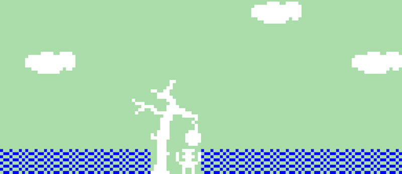

# *Let's Play: Ancient Greek Punishment: Bitsy Demake*

# [Play Online](https://www.pippinbarr.com/lets-play-ancient-greek-punishment-bitsy-demake) (mobile-friendly)

## Description
*The boulder is practically square! The apple is bare recognisable! Yet you push! Yet you reach! Yet you strain! Yet you weep! Punishment knows no minimum resolution!*

_Let's Play: Ancient Greek Punishment: Bitsy Demake_ is yet another new edition in the [Let's Play: Ancient Greek Punishment](https://pippinbarr.com/ideas/ancient-greek-punishment/) series, each focusing on a retelling of five (kind of) mythological punishments. In _Bitsy Demake_ the game is retold in the form of a Bitsy game using Adam Ledoux's wonderful game-creation tool [Bitsy](https://ledoux.itch.io/bitsy).

## Press
Read the [Press kit](../press) for press information

## Documentation
* Read the [Process documentation](../process) for process journal, research questions, and a closing statement
* Read the [Commit History](https://github.com/pippinbarr/lets-play-ancient-greek-punishment-bitsy-demake/commits/master) for step-by-step information about how the project was built
* Look at the [Code Repository](https://github.com/pippinbarr/lets-play-ancient-greek-punishment-bitsy-demake) for source code etc.

## License
_Let's Play: Ancient Greek Punishment: Bitsy Demake_ is an open source game licensed under a [Creative Commons Attribution-NonCommercial 3.0 Unported License](http://creativecommons.org/licenses/by-nc/3.0/). You can obtain the source code from its [code repository](https://github.com/pippinbarr/lets-play-ancient-greek-punishment-bitsy-demake) on GitHub.
