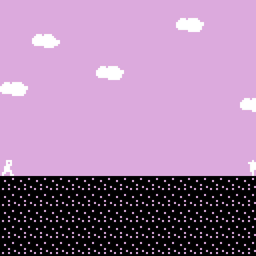

# _Let's Play: Ancient Greek Punishment: Bitsy Demake_ Press Kit

_The boulder is practically square! The apple is bare recognisable! Yet you push! Yet you reach! Yet you strain! Yet you weep! Punishment knows no minimum resolution!_

#### [Play _Let's Play: Ancient Greek Punishment: Bitsy Demake_](https://pippinbarr.github.io/lets-play-ancient-greek-punishment-bitsy-demake)

## The basics

* Developer: [Pippin Barr](http://www.pippinbarr.com/)
* Release: 17 July 2019
* Platform: Browser (desktop and mobile)
* Code repository: https://github.com/pippinbarr/lets-play-ancient-greek-punishment-bitsy-demake
* Price: $0.00

## Who is this Pippin Barr guy?

Pippin is an experimental game developer who has made games about everything from [Eurovision](http://www.pippinbarr.com/2012/03/27/epic-sax-game/) to [performance art](http://www.pippinbarr.com/2011/09/14/the-artist-is-present/) to [dystopian post-work futures](http://www.pippinbarr.com/games/2017/07/03/it-is-as-if-you-were-doing-work.html). He's an Assistant Professor in the [Department of Design and Computation Arts](http://www.concordia.ca/finearts/design.html) at [Concordia University](http://www.concordia.ca/) in Montréal. He is also the director of the [Technoculture, Art, and Games (TAG)](http://tag.hexagram.ca/) Research Centre, which is part of the [Milieux Institute for Arts, Culture, and Technology](http://milieux.concordia.ca/).

## Description

_Let's Play: Ancient Greek Punishment: Bitsy Demake_ is the tenth edition in the _Let's Play: Ancient Greek Punishment_ series begun in 2011 and comprising: [Let's Play: Ancient Greek Punishment](http://www.pippinbarr.com/games/letsplayancientgreekpunishment/LetsPlayAncientGreekPunishment.html) (2011), [Art Edition Edition](http://www.pippinbarr.com/games/letsplayletsplayancientgreekpunishmentarteditionedition/) (2015), [Limited Edition](http://www.pippinbarr.com/games/letsplayancientgreekpunishmentlimitededition/) (2016), [CPU Edition](http://pippinbarr.github.io/letsplayancientgreekpunishmentcpuedition/) (2017), [Inversion Edition](https://pippinbarr.github.io/lets-play-ancient-greek-punishment-inversion-edition) (2019), [UI Edition](https://pippinbarr.github.io/lets-play-ancient-greek-punishment-ui-edition) (2019), [Teaches Typing](https://pippinbarr.github.io/lets-play-ancient-greek-punishment-teaches-typing) (2019), [Chess Edition](https://pippinbarr.github.io/lets-play-ancient-greek-punishment-chess-edition) (2019), and [The Twine](https://pippinbarr.github.io/lets-play-ancient-greek-punishment-the twine) (2019). In _Bitsy Demake_ the punishments are presented as low-fi 2D experiences using the excellent browser-based game-making software [Bitsy](https://ledoux.itch.io/bitsy) by Adam LeDoux.

## History

_Bitsy Demake_ is part of my ongoing idea of essentially spending 2019 making variations on the base _Ancient Greek Punishment_ set of minigames as a way to remain "productive" while in transition to a life with a new baby.

In the case of this version more than others, I do think the term "demake" applies well. Bitsy is a powerfully accessible game engine, but it is a carefully limited one. A major part of the interest in producing a version of the punishment myths in Bitsy was exploring the possibility of expressing the (by now well-explored) ideas in such a simple environment. Even if, perhaps, the Twine version was also very stripped back, I still think it's the case that Twine has a great deal more flexibility that Bitsy does, not least because of the ability to use language to express scenarios, but also because of the serious number of "macros" (programming hooks) that Twine provides by default. Bitsy, by contrast, really strips things back to the extreme. In the end it was _very_ challenging to put together what I felt were at least reasonable representations of the myths (and the associated game versions I've made in the past), and that's the majority of my commentary both in the process journal and in the commit messages of the project. In the end, I'm pretty happy with how it came out, and this game in particular forms a very helpful data point in this continuing exploration not just of the punishment myths but of the affordances of different forms of game development.

_Let's Play: Ancient Greek Punishment: Bitsy Demake_ is also another reference point in the ultra-detailed process documentation approach called [MDMA](http://www.gamesasresearch.com/mdma). So, if you want to, you can read a lot about the game's development by reading its [process documentation](https://github.com/pippinbarr/lets-play-ancient-greek-punishment-bitsy-demake/blob/master/process/README.md), by going through its [commit history](https://github.com/pippinbarr/lets-play-ancient-greek-punishment-bitsy-demake/commits/master), and by reading the [research questions](https://github.com/pippinbarr/lets-play-ancient-greek-punishment-bitsy-demake/blob/master/process/research-questions.md).

## Technology

_Let's Play: Ancient Greek Punishment: Bitsy Demake_ was created in [Bitsy](https://ledoux.itch.io/bitsy), a thoughtfully simple game engine perhaps more easily charactersied as being for producing "walking simulators" in low-resolution 2D. To get the menu to work I also resorted to a single "[Bitsy Hack](https://github.com/seleb/bitsy-hacks)", but I avoided using anything but pure Bitsy in the games themselves.

## License

_Let's Play: Ancient Greek Punishment: Bitsy Demake_ is an open source game licensed under a [Creative Commons Attribution-NonCommercial 3.0 Unported License](http://creativecommons.org/licenses/by-nc/3.0/). You can obtain the source code from its [code repository](https://github.com/pippinbarr/lets-play-ancient-greek-punishment-bitsy-demake) on GitHub.

## Features

- Noble attempts at representation in few pixels!
- A spinny boulder!
- Hand-lettering in pixels!
- Spatial loops!
- Dialog!

### Trailer

See animated GIFs.

## Images

  
Prometheus

  
Sisyphus

  
Tantalus

  
Danaids

  
Zeno

## Press

- Coming soon?

## Additional Links

- [Process documentation of _Let's Play: Ancient Greek Punishment: Bitsy Demake](https://github.com/pippinbarr/lets-play-ancient-greek-punishment-bitsy-demake/blob/master/process/README.md)
- [Commit history of _Let's Play: Ancient Greek Punishment: Bitsy Demake](https://github.com/pippinbarr/lets-play-ancient-greek-punishment-bitsy-demake/commits/master)

## Credits

* Pippin Barr: basically everything?

## Contact

* Email: [pippin.barr+press@gmail.com](mailto:pippin.barr+press@gmail.com)
* Website: [www.pippinbarr.com](http://www.pippinbarr.com/)
* Twitter: [@pippinbarr](https://www.twitter.com/pippinbarr)
* Instagram: [@pippinbarr](https://www.instagram.com/pippinbarr)
* Facebook: [Pippin Barr](http://www.facebook.com/pippin.barr)
