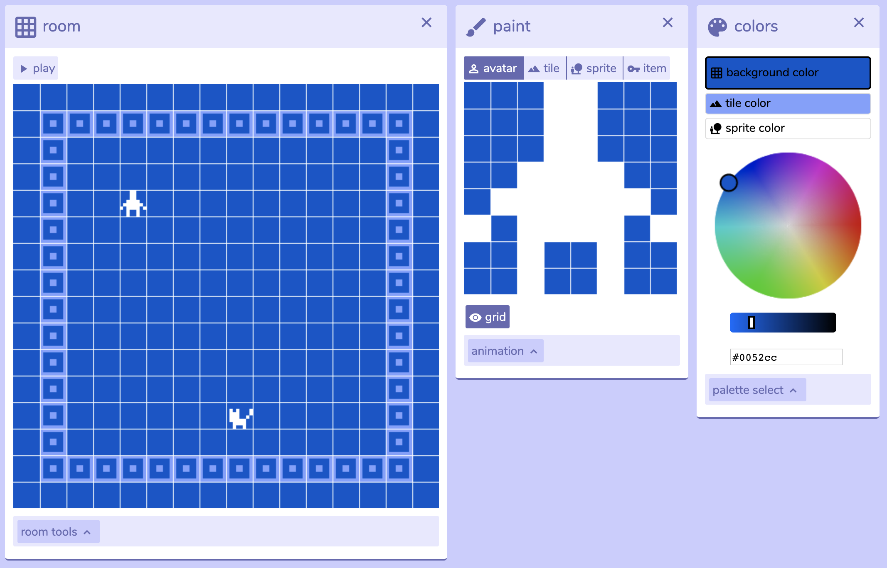
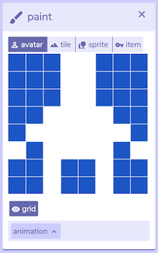

# Bits and Pieces of Suffering: Creating Ancient Greek Punishments in Bitsy

(Note: throughout this text, I’ll be linking to [process materials](https://github.com/pippinbarr/lets-play-ancient-greek-punishment-bitsy-demake/blob/master/process/README.md) generated as part of the project in its [code repository](https://github.com/pippinbarr/lets-play-ancient-greek-punishment-bitsy-demake). I'll also cite specific "commits" (moments of active development) by their hash number where relevant. This approach to process documentation is part of the [Games as Research](https://www.gamesasresearch.com/) project.)

[_Let's Play: Ancient Greek Punishment: Bitsy Demake_](https://pippinbarr.github.io/lets-play-ancient-greek-punishment-bitsy-demake) is the tenth edition in the "Ancient Greek Punishment" series I've been working on since 2011. As a kind of companion piece to [the Twine version](https://pippinbarr.github.io/lets-play-ancient-greek-punishment-the-twine/) I made previously, I decided to make the same five punishment myths in the "other" highly popular and accessible game engine, [Bitsy](https://ledoux.itch.io/bitsy). By way of reminder, those punishments are: Sisyphus (pushing a boulder up a hill), Tantalus (reaching for unattainable food and drink), Prometheus (chained to a rock with his liver being pecked out), Danaids (eternally trying to fill a leaking bath/basin), and Zeno (doomed to run a race that cannot be finished).

  
_The most basic Bitsy interface_

Bitsy is a web-based tool for making simple 2D games that allow the player to move a character around and between a series of "rooms" (which could represent indoor or outdoor spaces or anything else) and to interact with "items" (by picking them up) and "sprites" (by bumping into them). It's not too much more complicated than that, which makes it a lovely tool for quickly building clear and direct exploration experiences, environmental storytelling, and related forms of play.

In the case of the punishment games, I was most interested in how such a basic set of tools would be able to accommodate the myths in question. In the following, I want to explore this by highlighting some of the moments of tension between the ideas I wanted to convey and the specific constraints of Bitsy. In doing so, I want to continue my voyage of thinking about the central relationship between game design and game technology.

## 8x8s and heartbreak

One thing you're confronted with as soon as you start using Bitsy is the serious limitation on making images. Bitsy's games are "tile based", composed of a collection of 8x8 pixel tiles. Your avatar is one tile, sprites are each one tile, and so on. 8x8 is not a lot of space to work with.

The most obvious thus came in trying to use this tool to represent the key elements in each myth, particularly in terms of legibility. Representing any complex form in 8x8 is just not especially realistic, so there was a real need to simply the images of the game, often shooting for something more iconic than "realistic". It's very possible to draw a little "person" shape (which I did for Zeno, Tantalus, and Prometheus), but more detailed compositions like a person pushing a boulder just won't fly - not enough pixels. This was thus a big factor behind the decision to make the avatar in Sisyphus be just the boulder itself, for instance (more on this later).

Along with the avatar issue, there's the need to represent environmental elements such as rocks or clouds, etc. There was a part of me that wanted the purity of one object per tile, as there's a kind of atomic truth to that. However, it just isn't possible to draw a very convincing cloud in 8x8. The solution, much more magnificently demonstrated by more experience and talented Bitsy authors, is to compose complex scenery out of multiple tiles. It makes the actual management of tiles a bit of a hellscape, but it means you've got the potential for much more "resolution" in your visual elements. A room is 16x16 tiles, and tiles are 8x8, so the largest possible image you could create would be 128x128 - still smaller than most desktop icons, but enough to make something pretty recognizable. As such, things like the rock in Prometheus are composed of multiple kinds of tiles to allow for a more naturalistic/organic line rather than the hideously blocky early attempts.

Thus, for instance, rather that representing the avatar in Sisyphus as a person pushing a boulder (more on why the boulder is not separate later),

As such, people who make Bitsy games are often geniuses at using the tool to create evocative and complex scenes.

- 8x8 (avatars, multi-tile shapes (clouds, rock, bathtub), legibility issues, texture)

## The majesty of minimal colours

- The mystery of colours (Red tantalus -> Evil apple -> white apple, need for clouds changes things, brown rock -> white, background colours from original games, especially potent because of the limit to three)

## 5 items or less

- The failure of items (Sisyphus had to become a boulder, Danaids had to become water, apple had to become a sprite - otherwise not tempting as it would have to be too far)

## I like to move it move it

- Movement (and its restriction, as key interactive elements, has to be saved for the punishment rather than exploration of a larger environment as in standard Bitsy)

## The spacetime continuum

- Space is time (typical Bitsy thing of sometimes using connected rooms to represent a passage of time rather than space, water draining (multi-stage), boulder returning, flag failure, ...) -- see also that Moth to a Flame one

## Avatar

At the heart of a Bitsy game is your _avatar_, an 8x8 pixel character that you can move around in the world using the arrow keys and tile-based movement. Given that this is essentially the only form of input a player has, this movement is really the crux of any kind of expressive interaction you can create in a Bitsy game.

In the case of the punishments, this meant that the key action needed to be representable as movement in a 2D grid. For the large part this is fine because the punishments do essentially focus on movement or the restriction of movement. Difficulties came in determining how to represent the avatar at such low resolution. In Sisyphus, having the avatar be both a person and a boulder would have meant an indecipherable image

- Subject/object
- Resolution
- Movement

## Tile

- Visible/invisible
- Realism/physics
- Combination resolution

## Item

## Sprite

## Palette

## Room

## Title

## Extensions

Alternative structure (because I'm dying of boredom right now)

---

++ Definitely a good idea to pop in screenshots from past builds in this case (with commit number in the caption)

  - avatar (as person/object)
  - movement (could be folded into above? movement as the key interaction - the need to preserve it for key activity of a myth rather than exploratory as in most Bitsy works?)
  - walls (invisible and visible, preventing movements most obviously, most often for realism/"physics" of various kinds, including chains - also the concept of detail through multiple tiles creating a single object, the bathtub and the rock)
  - items versus sprites (dialog element is crucial here, as well as their interaction with the palette to look distinct, dialog [see also: Twine] a central way to communicate some more complex and unrepresentable concept?) (maybe collapse these two?)
  - items (total failure despite burning desire to use them!)
  - palettes (oddities around connotations of colours and shared palettes, black clouds and white apples etc.)
  - rooms and exits (for state rather than space in Danaids, "rolling" in Sisyphus, "time" in Zeno - I guess all room transitions are used to represent time rather than space?)
  - intro/title (as a way to include instructions and take some burden off the communication of the scene itself)
  - Extensions (and avoiding them)
- I think I like the idea of going this way, and it allows me to tell of various "battles" with the Bitsy Way. Very much feels like a story of a fight to "tell my story" with a vocabulary at some kind of oppositional angle to that story. Interesting coming so specifically from a more "videogame" telling of these things to something that already has all the game mechanics baked in, rather than first-order stuff you can build to your idea
- Comparison with Twine somewhere makes sense (probably in the intro?)

I actually think this isn't too bad an attempt. I think even if some of these sections are little there's something nice about the fact you can really break down Bitsy like this and talk about all its pieces quite successfully? And I think it's also true that in reviewing each one you can talk about how they're leveraged - almost every single one has one or more stories to tell. Plus images. Plus links to commits. I think this will work and should be comparatively easy to write? (Famous last words?)
