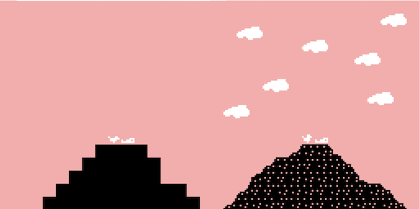
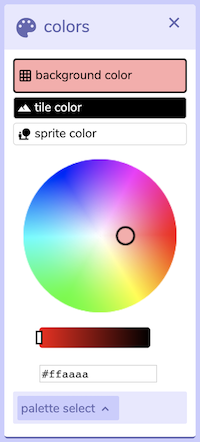
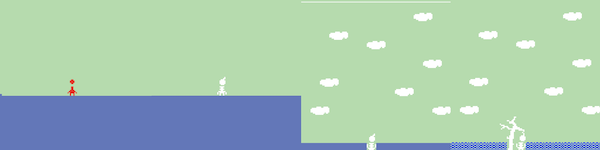

# Bits and Pieces of Suffering: Creating Ancient Greek Punishments in Bitsy

(Note: throughout this text, I’ll be linking to [process materials](https://github.com/pippinbarr/lets-play-ancient-greek-punishment-bitsy-demake/blob/master/process/README.md) generated as part of the project in its [code repository](https://github.com/pippinbarr/lets-play-ancient-greek-punishment-bitsy-demake). I'll also cite specific "commits" (moments of active development) by their hash number where relevant. This approach to process documentation is part of the [Games as Research](https://www.gamesasresearch.com/) project.)

[_Let's Play: Ancient Greek Punishment: Bitsy Demake_](https://pippinbarr.github.io/lets-play-ancient-greek-punishment-bitsy-demake) is the tenth edition in the "Ancient Greek Punishment" series I've been working on since 2011. As a kind of companion piece to [the Twine version](https://pippinbarr.github.io/lets-play-ancient-greek-punishment-the-twine/) I made previously, I decided to make the same five punishment myths in the "other" highly popular and accessible game engine, [Bitsy](https://ledoux.itch.io/bitsy). By way of reminder (and links), those punishments are: [Sisyphus](https://pippinbarr.github.io/lets-play-ancient-greek-punishment-bitsy-demake/sisyphus.html) (pushing a boulder up a hill), [Tantalus](https://pippinbarr.github.io/lets-play-ancient-greek-punishment-bitsy-demake/tantalus.html) (reaching for unattainable food and drink), [Prometheus](https://pippinbarr.github.io/lets-play-ancient-greek-punishment-bitsy-demake/prometheus.html) (chained to a rock with his liver being pecked out), [Danaids](https://pippinbarr.github.io/lets-play-ancient-greek-punishment-bitsy-demake/danaids.html) (eternally trying to fill a leaking bath/basin), and [Zeno](https://pippinbarr.github.io/lets-play-ancient-greek-punishment-bitsy-demake/zeno.html) (doomed to run a race that cannot be finished).

  
_The most basic Bitsy interface_

Bitsy is a web-based tool for making simple 2D games that allow the player to move a character around and between a series of "rooms" (which could represent indoor or outdoor spaces or anything else) and to interact with "items" (by picking them up) and "sprites" (by bumping into them). It's not too much more complicated than that, which makes it a lovely tool for quickly building clear and direct exploration experiences, environmental storytelling, and related forms of play.

In the case of the punishment games, I was most interested in how such a basic set of tools would be able to accommodate the myths in question. In the following, I want to explore this by largely highlighting moments of tension between the ideas I wanted to convey and the specific constraints of Bitsy.

## 8x8s and heartbreak

One thing you're confronted with as soon as you start using Bitsy is the serious limitation on making images. Bitsy's games are "tile based", composed of a collection of 8x8 pixel tiles. Your avatar is one tile, sprites are each one tile, and so on. 8x8 is not a lot of space to work with.

  
_The Bitsy drawing panel_

The most obvious issue came in trying to use this tool to represent the key elements in each myth, particularly in terms of legibility (see my sadness about Prometheus in [0b18f11](https://github.com/pippinbarr/lets-play-ancient-greek-punishment-bitsy-demake/commit/0b18f112169eb04d2cb4f86f25d81065694c5954)). Representing any complex form in 8x8 is just not easy, so there was often a real need to simplify the images of the game, often shooting for something more iconic than "realistic". This is especially true of the avatars, which have a hard limit of a single tile shape. It's very possible to draw a little "person" shape (which I did for Zeno, Tantalus, and less successfully for Prometheus), but more detailed compositions like a person pushing a boulder just won't fly - not enough pixels. This was thus a big factor behind the decision to make the avatar in Sisyphus be just the boulder itself, for instance.

  
_Sisyphus the Boulder_

Along with the avatar issue, there's the need to represent environmental elements such as rocks or clouds, etc. There was a part of me that wanted the purity of one object per tile, as there's a kind of atomic truth to that. However, it just isn't possible to draw a very convincing cloud in 8x8. The solution, much more magnificently demonstrated by more experience and talented Bitsy authors, is to compose complex scenery out of multiple tiles. It makes the actual management of tiles a bit of a hellscape, but it means you've got the potential for much more "resolution" in your visual elements. A room is 16x16 tiles, and tiles are 8x8, so the largest possible image you could create would be 128x128 - still smaller than most desktop icons, but enough to make something pretty recognizable. As such, things like the rock in Prometheus are composed of multiple kinds of tiles to allow for a more naturalistic/organic line rather than the hideously blocky early attempts ([9128154](https://github.com/pippinbarr/lets-play-ancient-greek-punishment-bitsy-demake/commit/91281546129148f4541e9147b4bdcb92c02174e3)).

  
_Prometheus's rock, before and after_

## The majesty (and misery?) of colours

A major feature of Bitsy is its limited colour palettes. In fact for a single screen (room) you can only have 3 distinct colours: a background, a standard tile colour, and a sprite colour (for sprites, items, and the avatar). As you might imagine, this can make it a challenge to have everything in a scene be a "realistic" colour and it becomes correspondingly harder to rely on colour as a way explain to a player what something is, you really need to rely on (8x8 pixel) form.

  
_Bitsy's colour panel_

Background colours were pretty straightforward since the punishment series has what I think of as quite iconic pastel-ish background colours already established, I just used them. Similarly, the basic tile colour is almost always black, corresponding to the default pixel colour in the original punishment game, which uses black as a kind of nod to images on ancient Greek pottery etc. Things got weird with the sprite colour.

My initial assumption had been that I would do the very tidy thing of having the sprite colour match the "highlight colour" I'd used in the original game (e.g. the yellow of Prometheus's chains or the green of the flag). This had a pleasing symmetry to it, but in practice didn't actually work. Consider Tantalus, which must contain an apple (traditionally red!), water (traditionally blue!), the background (a nice green), an avatar (black in the games), and ideally some clouds (white!) and a tree (brown and green???). Disaster. If the apple (a sprite) is red (in keeping with the original game) then the avatar has to be red too, since it shares the sprite colour. This looks bad ([f28008d](https://github.com/pippinbarr/lets-play-ancient-greek-punishment-bitsy-demake/commit/f28008d67ce12e836d2a7fde283fc2ae8ee301d4)). If the avatar is black (in keeping with the original game), then the apple has to be black too, but this makes it look like an evil death apple ([cb816c5](https://github.com/pippinbarr/lets-play-ancient-greek-punishment-bitsy-demake/commit/cb816c50ebb0e5e38369dd2aa858576c438fc1c8)).

This is all compounded by the fact that while working on Zeno, the most visually blank of the scenes, I realised it would help to have clouds in every scene as a way to add some detail to the sky area ([d97aad4](https://github.com/pippinbarr/lets-play-ancient-greek-punishment-bitsy-demake/commit/d97aad4a4620ba96e98f4f80b84b39ceb7ff70be)). Clouds are, as everyone knows, white, and so with two colours already taken (the background colour and the black of the base tile), the sprite colour effectively had to be white in most levels (e.g. [2a8453c](https://github.com/pippinbarr/lets-play-ancient-greek-punishment-bitsy-demake/commit/2a8453cc4fbca359f5d6c3da323ccebc4c50aace)).

  
_The progression of colour and scene design in Tantalus_

This led, in turn, to a need to communicate more clearly about the apple, given it was white, eventually creating the need for a (white) tree to further explain it, as well as a dialog message that literally tells you the apple is an apple.

Also visible in the Tantalus scene is a particular feature of Bitsy's sprites - they always have the _background colour_ as their background rather than having transparency. This is part of Bitsy's aesthetic charm, but is also odd-looking, since it means that the avatar in particular "erases" parts of the background when it moves over them, as you can see with Tantalus in the water here. It was a kind of wonderful moment when I realised that for this specific scene, this specificity of Bitsy is actually a beautiful win: Tantalus cannot drink the water in the myth, and here it's as if Bitsy itself solved the problem of representing this! Wherever you move the avatar, the water "recedes" from him because it can't share his tile, creating the effect of undrinkable, ever elusive water. This is probably my favourite moment of interaction between design and platform in this whole game ([f28008d](https://github.com/pippinbarr/lets-play-ancient-greek-punishment-bitsy-demake/commit/f28008d67ce12e836d2a7fde283fc2ae8ee301d4)).

## 5 items or less

One objective I often have when using new tools is to think about the specific kind of world the tool makes possible, the map of reality is has under the hood. So, in the case of Bitsy, I was excited to use the idea of "items" as a specific part of my design. In Bitsy an item is a tile you can walk onto which then displays a message and disappears (as in, you picked it up).

  
_Default Bitsy "item" panel_

In thinking this through, I imagined the ability to use items for a kind of "authenticity" in the telling of the myths, but it was not to be ([ac29f28](https://github.com/pippinbarr/lets-play-ancient-greek-punishment-bitsy-demake/commit/ac29f284f3929d2a5265ce451e08760ff40d59cd)). In particular, I figured I'd be able to make the apple in Tantalus an item as this would have a delightful truth to it: the apple would genuinely be something you _could_ pick up (technically, according to Bitsy's code), you just wouldn't be able to reach it, just like Tantalus (see this [process journal entry](https://github.com/pippinbarr/lets-play-ancient-greek-punishment-bitsy-demake/blob/master/process/process-journal.md#tantalus)). However, it turned out that if the apple was an item it would have to be at least one tile removed from Tantalus (in order for it to be blocked off from him) and, while this was funny, it removed the ability to display a message when Tantalus _tried_ to reach it. Given my anxieties about the representation being pretty hard to decipher (as above), I decided to make the apple a sprite instead, so the player could "bump into it" and see a message about failing to grasp it ([f28008d](https://github.com/pippinbarr/lets-play-ancient-greek-punishment-bitsy-demake/commit/f28008d67ce12e836d2a7fde283fc2ae8ee301d4)). In retrospect I'm not completely certain this was the right call, but it felt like the best move at the time.

In what I thought was quite a novel use of items, I also [planned to make Sisyphus's _boulder_ an item that could be picked up](https://github.com/pippinbarr/lets-play-ancient-greek-punishment-bitsy-demake/blob/master/process/process-journal.md#sisyphus). This way the Sisyphus scenario would be that you would pick up the boulder at the foot of the hill and carry it to the top, only to receive a message that it had rolled back down. You'd go back down and there it would be again. I still think this is funny, but it turns out not to be possible: when you pick up an item it is _gone for good_, so when you return to where it was (even if you've visited other places during the play-through), it'll still be gone. This is an example of how Bitsy resisted the inherently _cyclical_ nature of the punishment myths - with items in particular there was no way have that kind of infinity, they were obstinately finite (see this [woe filled process journal entry](https://github.com/pippinbarr/lets-play-ancient-greek-punishment-bitsy-demake/blob/master/process/process-journal.md#avatar-sprites-items-oh-my-)).

In the end I didn't use any items at all, which I view as a kind of failing given how central they feel to the effectiveness of Bitsy, but also as a good example of how there can be poor fits between specific design objectives and the actual affordances of a tool.

## I like to move it move it

A key point of tension between the myths and Bitsy is that the myths naturally involve the player trying to carry out some sort of _activity_, while Bitsy is most centrally a game engine about a player _moving_ through a world, talking to things, and picking things up. As such, all the myths have to be told via movement and dialog (items being disregarded as above) and thus movement can't really be used for exploration anymore, it needs to be [reserved for expressing the task at hand](https://github.com/pippinbarr/lets-play-ancient-greek-punishment-bitsy-demake/blob/master/process/process-journal.md#separate-bitsies).

This is what led to having the avatar in both Sisyphus and Danaids be the actual object of torment rather than a person interacting with those objects. There's no way in Bitsy for an avatar to _push_ anything, so [the only way to move the boulder is to _be_ the boulder](https://github.com/pippinbarr/lets-play-ancient-greek-punishment-bitsy-demake/blob/master/process/process-journal.md#be-the-boulder-you-want-to-see-in-the-world). It's quite nicely philosophical in a way that Camus might approve of? This is also nice in that it pushes the role of Sisyphus much more directly onto the player of the game - you're the one pushing the boulder around with the arrow keys, there's no intermediary. Similarly, in Danaids, you can't have an avatar pick up and transport the water (items don't work for this damnit!), so the avatar _is the water_, which the _player_ then transports to the bathtub.

  
_You are the water in Danaids_

In the other myths, the focus of Bitsy of movement works nicely because the myths focus on some kind of movement through space as their core activity. Zeno, most obvious, is running a race and so must move through space to do so - the standard avatar works well here. Tantalus is involved in a kind of movement when he is _reaching_ for things, so it's not too hard to reinterpret his movement through the water as a "quest" for water (perpetually thwarted by the background effect discussed earlier), and the use of the up arrow beneath the apple is a special case of a _failed_ movement (not permitted because you can't walk onto a sprite) ([cb816c5](https://github.com/pippinbarr/lets-play-ancient-greek-punishment-bitsy-demake/commit/cb816c50ebb0e5e38369dd2aa858576c438fc1c8)). Prometheus is all about failed movement ([0b18f11](https://github.com/pippinbarr/lets-play-ancient-greek-punishment-bitsy-demake/commit/0b18f112169eb04d2cb4f86f25d81065694c5954)), surrounded by invisible sprites that serve as his chains (and deliver messages about the hopelessness of his situation) - here a lack of movement is what is needed and that negation fits into Bitsy's possibilities nicely.

  
_Prometheus cannot escape_

## The spacetime continuum

The standard approach to using Bitsy is to make an exploration experience. This is implied by the metaphor of "rooms" (individual screens) and "exits" (special tiles that allow you to move from room to room). Naturally, the clearest way to use these two elements of Bitsy is to make interconnected spaces that the player navigates, often while unfolding some kind of story or environmental storytelling.

As many Bitsy authors experiment with, however, the rooms/scenes don't really _have_ to be connected in a logical spatial fashion. There could be weird spatial effects, for instance, or indeed the connections could be in _time_. This could be a dramatic time-travel effect in which you jump 60 years into the past, or it could be used to create very small shifts in time, amounting to _animation_ (I particularly like the effect achieved in [Day in the Life](https://linda-nd.itch.io/day-in-the-life) by [Linda ND](https://linda-nd.itch.io/)).

In the punishment myths this is important because they often need to create what amounts to a loop in time, with the player returning to a starting position (but with time having actually passed). Thus in Zeno the avatar reaches the half-way point only to be "teleported" (by an exit) back to the starting position (in the room), a nod to my original portrayal of this myth ([bf0ccd1](https://github.com/pippinbarr/lets-play-ancient-greek-punishment-bitsy-demake/commit/bf0ccd1d3f10e6f5f2755a377d8cfd459fb84de6)). Sisyphus uses this same idea: the boulder teleports from the top of the hill to the bottom, with the actual "rolling down" being implied between frames (not unlike the idea in Scott McLeod's _Understanding Comics_ of "closure" using the gutters of a comic).

  
_Poor old Zeno only ever gets half-way_

Finally, this kind of animated use of space can be helpful for making a more comprehensible experience. In Danaids when you place the water (avatar) into the bathtub, we need it to "leak out", which of course isn't something Bitsy can do straightforwardly. Instead, it was necessary to teleport the player to a room in which the water remains in the bathtub as a sprite, but the avatar has moved back to the starting position. On the player's first move, they are teleported back to the original room (without the water in the bathtub), creating an illusion of the water having drained away. It's primitive, but far more compelling than the earlier version in which putting the water into the bathtub just cut immediately to the water being gone and the avatar-water being back at the start ([66ee125](https://github.com/pippinbarr/lets-play-ancient-greek-punishment-bitsy-demake/commit/66ee12528ae6fc0cadf5398f512e689f6c09bd38)) - "spatial animation" allows this experience to be extended just enough to be a bit clearer ([e340c4e](https://github.com/pippinbarr/lets-play-ancient-greek-punishment-bitsy-demake/commit/e340c4eb4e169b5718d9c9ee4359fbb110e065e9)).

## Conclusion

Perhaps what I've found most interesting about making and thinking about (re)making these games in the form of Bitsy games is just how much detail is involved in the translation. It isn't the case that because the myths are pretty simple and Bitsy is pretty simple that their conjunction will be straightforward. Rather, the ways in which the story and the storytelling device conflict and contrast create frustrating, but generative problems that require a depth of design thinking I wouldn't have expected.
